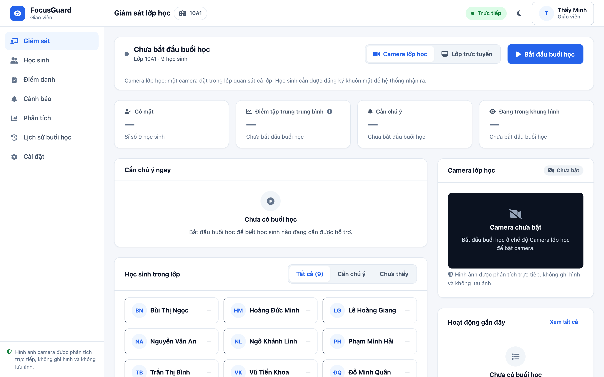
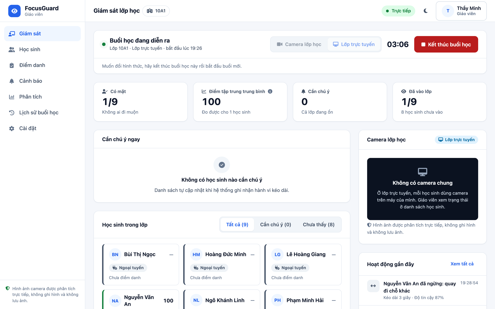
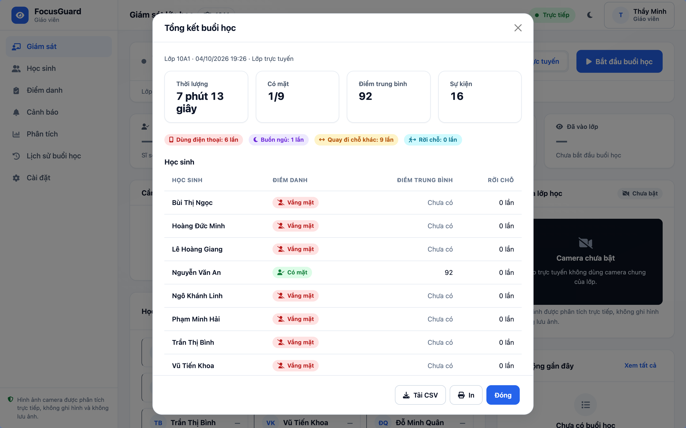

# FOCUSGUARD
## Hồ sơ dự án – AI Tài Năng Việt 2026 • Bảng A THCS

> **Thông điệp chính:** FocusGuard không thay giáo viên và không "chấm" học sinh bằng AI. Hệ thống dùng camera để ghi nhận các tín hiệu hành vi quan sát được theo thời gian và tạo một chỉ số theo quy tắc công khai, giúp giáo viên biết lúc nào một học sinh cần được quan tâm.

| Thông tin | Nội dung |
|---|---|
| Tên đội | iKH Future Makers |
| Thành viên | Nguyễn Hoàng Bảo Long |
| Trường/Lớp | Lớp 8/1 - THCS Tây Nha Trang, Khánh Hòa |
| Giáo viên hướng dẫn | Phan Tuấn Kiệt - Trung tâm tin học iKH - Giám Đốc |
| Bảng thi | Bảng A – Học sinh THCS |
| Sản phẩm | FocusGuard – Hệ thống hỗ trợ giáo viên nhận biết tín hiệu mất tập trung bằng camera |
| Phiên bản mô tả | Nhánh chính `main` tại commit `950f8f5` (đã gồm giao diện mới; mã ứng dụng giống hệt commit `a9a0406` dùng để kiểm thử và chụp ảnh) |

# 1. Vấn đề thực tế

Trong một lớp học, giáo viên phải vừa giảng bài, vừa quan sát nhiều học sinh cùng lúc. Những hành vi như dùng điện thoại, nhắm mắt kéo dài, quay đầu lâu hoặc rời chỗ có thể khó được phát hiện kịp thời, nhất là khi lớp đông. FocusGuard được xây dựng để hỗ trợ quan sát, không thay thế đánh giá sư phạm của giáo viên.

## Mục tiêu
- Ghi nhận các tín hiệu quan sát được bằng camera theo thời gian, bỏ qua những khoảnh khắc rất ngắn.
- Hiển thị trạng thái và lịch sử cho đúng người dùng: giáo viên, học sinh, phụ huynh, quản trị viên.
- Tính điểm tập trung bằng quy tắc công khai, không gọi đó là mô hình AI dự đoán.
- Bảo vệ dữ liệu: không ghi video; không nhận diện cảm xúc; không đo hướng nhìn; không tự động dùng kết quả để kỷ luật hay chấm hạnh kiểm.

## Giá trị nổi bật
| Khía cạnh | FocusGuard |
|---|---|
| Bài toán | Hỗ trợ giáo viên quan sát lớp học |
| Mô hình AI có sẵn | YOLOv8, ByteTrack, MediaPipe, InsightFace |
| Phần logic riêng của dự án | Ổn định danh tính, phân tích hành vi theo thời gian, bộ tính điểm duy nhất, quản lý buổi học, cập nhật trực tiếp, phân quyền, thống kê |
| Nguyên tắc | Minh bạch – kiểm chứng được – không phóng đại năng lực AI |

# 2. Đối tượng sử dụng & hành trình sản phẩm

FocusGuard có bốn vai trò. Mỗi vai trò chỉ xem được dữ liệu trong phạm vi quyền của mình; quyền được kiểm tra ở máy chủ.

| Vai trò | Nhu cầu chính | Phạm vi dữ liệu |
|---|---|---|
| Giáo viên | Giám sát buổi học, xem ai cần chú ý, điểm danh, lịch sử | Lớp giáo viên được phân công |
| Học sinh | Xem trạng thái và lịch sử của bản thân | Chính học sinh đó |
| Phụ huynh | Theo dõi kết quả của con | Học sinh được liên kết |
| Quản trị viên | Quản lý lớp, tài khoản, đăng ký khuôn mặt | Phạm vi quản trị |

## Luồng giáo viên
1. Đăng nhập, mở trang **Giám sát** của lớp mình.
2. Chọn hình thức **Camera lớp học** (một camera cho cả lớp) hoặc **Lớp trực tuyến** (mỗi học sinh dùng camera của mình) rồi bấm **Bắt đầu buổi học**.
3. Hệ thống ghi nhận học sinh có mặt và trạng thái của từng em.
4. Một hành vi chỉ trở thành sự kiện khi kéo dài đủ ngưỡng thời gian.
5. Mục **Cần chú ý ngay** cho biết em nào, hành vi gì, kéo dài bao lâu; giáo viên quyết định có can thiệp hay không.
6. Bấm **Kết thúc buổi học**; hệ thống lưu bảng tổng kết và lịch sử từ dữ liệu đã ghi nhận.



*Ảnh 1 – Trang Giám sát khi chưa bắt đầu buổi học. Các ô số liệu để "—" và ghi rõ "Chưa bắt đầu buổi học", camera báo "Chưa bật": giao diện không điền số khi chưa có dữ liệu.*

**Tránh suy diễn sai:** "Ngoại tuyến", "Vắng mặt", "Tạm khuất", "Mất tín hiệu camera" và các hành vi mất tập trung là những trạng thái khác nhau trên giao diện.

**Không có dữ liệu giả:** khi chưa đủ dữ liệu, giao diện ghi "Chưa có" hoặc "Chưa đủ dữ liệu" kèm điều kiện cần có, không ghi số 0.

# 3. Kiến trúc hệ thống

```text
Camera
  ↓
YOLOv8 (phát hiện người, điện thoại) + ByteTrack (theo dõi người qua các khung hình)
  ↓
MediaPipe (mốc khuôn mặt) + InsightFace (đặc trưng khuôn mặt)
  ↓
IdentityManager → mã học sinh đã xác nhận
  ↓
BehaviorAnalyzer → hành vi kéo dài theo thời gian
  ↓
FocusEngine → điểm theo giây
  ↓
SessionRuntime → sự kiện + ảnh chụp điểm số theo thời gian
  ↓
Socket.IO + SQLite/Firestore → trang giám sát & lịch sử
```

## Thiết kế danh tính
- ByteTrack chỉ cấp một **số theo dõi tạm thời** (`track_id`); số này có thể đổi khi học sinh bị che hoặc rời khung hình nên không được coi là danh tính.
- InsightFace tạo vector đặc trưng khuôn mặt. IdentityManager chỉ xác nhận một học sinh khi độ giống đủ cao (≥ 0,45), hơn hẳn ứng viên thứ hai (≥ 0,08) và lặp lại 3 lần liên tiếp trong ít nhất 0,6 giây.
- Khi đã xác nhận, danh tính được giữ ("khóa"); chỉ bỏ khi có nhiều lần nhận dạng mâu thuẫn liên tiếp. Có thời gian chờ chống đổi qua lại, cơ chế nhận lại học sinh khi số theo dõi thay đổi, và không cho một học sinh gắn với hai người cùng lúc.

## Máy chủ quyết định
Trình duyệt không được gửi điểm, danh tính hay trạng thái AI để máy chủ tin theo. Kênh cập nhật trực tiếp (Socket.IO) chia phòng theo lớp và theo học sinh; máy chủ quyết định dữ liệu nào được gửi cho ai.

# 4. AI và cách tính "tập trung"

FocusGuard tách rõ mô hình AI có sẵn với phần logic riêng của dự án.

| Thành phần | Nguồn | Vai trò |
|---|---|---|
| YOLOv8 | Có sẵn (Ultralytics) | Phát hiện người và điện thoại trong khung hình |
| ByteTrack | Có sẵn | Theo dõi cùng một người qua các khung hình |
| MediaPipe Face Landmarker | Có sẵn (Google) | Mốc khuôn mặt → độ mở mắt, góc quay đầu |
| InsightFace | Có sẵn | Vector đặc trưng khuôn mặt |
| BehaviorAnalyzer | Logic của dự án | Biến tín hiệu thô thành sự kiện kéo dài theo thời gian |
| FocusEngine | Logic của dự án | Cộng/trừ điểm theo thời gian bằng quy tắc công khai |

## Ngưỡng hành vi
| Hành vi | Điều kiện | Ý nghĩa |
|---|---|---|
| Dùng điện thoại (PHONE) | Thấy điện thoại liên tục từ 1 giây | Điện thoại lướt qua không bị tính |
| Buồn ngủ (DROWSY) | Mắt nhắm liên tục từ 1,5 giây | Chớp mắt không bị tính; ngưỡng mắt nhắm tính theo độ mở mắt bình thường của từng học sinh |
| Quay đi chỗ khác (HEAD_AWAY) | Đầu lệch quá 20° liên tục từ 2 giây | Liếc nhanh không bị tính |
| Rời chỗ (AWAY) | Không thấy học sinh từ 10 giây | Rời khung hình đủ lâu |
| Tạm khuất | Không thấy dưới 10 giây | Không trừ điểm |

## FocusEngine
Điểm bắt đầu từ 100, nằm trong khoảng 0–100. Tập trung: +0,5 điểm/giây • Dùng điện thoại: −2 • Buồn ngủ: −1,5 • Quay đi: −1 • Rời chỗ: −1 • Tạm khuất, chưa có dữ liệu hoặc mất tín hiệu camera: **giữ nguyên điểm**.

Điểm này là **quy tắc tính theo thời gian (heuristic)**, không phải mô hình máy học dự đoán "mức độ tập trung thật". Các hệ số là lựa chọn của dự án, chưa được hiệu chỉnh bằng dữ liệu thật. FocusGuard không nhận diện cảm xúc và không đo hướng nhìn.

# 5. Sản phẩm & trải nghiệm người dùng

## Trang Giám sát của giáo viên
- Trạng thái buổi học (hình thức, giờ bắt đầu, đồng hồ) và trạng thái camera.
- Bốn ô số liệu: có mặt, điểm tập trung trung bình, số em cần chú ý, số em đang được ghi nhận.
- Mục **Cần chú ý ngay**: tên học sinh, hành vi, thời gian kéo dài và gợi ý xử lý.
- Thẻ từng học sinh với trạng thái bằng màu, biểu tượng và chữ.
- Kết thúc buổi học có hộp xác nhận, sau đó hiện bảng tổng kết.



*Ảnh 2 – Buổi học đang diễn ra (lớp trực tuyến, camera thật, một người thử). Học sinh đã vào lớp hiện "Tập trung" với điểm 100; tám tài khoản chưa vào lớp hiện "Ngoại tuyến" và không có điểm, không bị coi là mất tập trung.*


*Ảnh 3 – Cùng buổi học, khi người thử cầm điện thoại trước camera: mục Cần chú ý ngay ghi "Dùng điện thoại · 8 giây" kèm gợi ý "Nhắc học sinh cất điện thoại", điểm của em giảm còn 73.*

## Camera lỗi
Camera ngắt không làm kết thúc buổi học. Giao diện báo "Mất tín hiệu camera" hoặc "Không dùng được camera" kèm nút Thử lại; điểm được giữ nguyên, không bị trừ. Khi camera trở lại, buổi học tiếp tục.

## Cập nhật trực tiếp và quyền
| Tình huống | Cách xử lý |
|---|---|
| Trình duyệt học sinh tự gửi điểm | Máy chủ từ chối (`client_state_rejected`) |
| Giáo viên mở lớp không được phân công | Bị chặn (HTTP 403) |
| Học sinh / phụ huynh | Chỉ nhận dữ liệu của học sinh được phép, không nhận số liệu cả lớp |
| Chưa đủ dữ liệu thống kê | "Chưa có" / "Chưa đủ dữ liệu" |

Công nghệ: Python + Flask + Flask-SocketIO; lưu trữ SQLite hoặc Firestore; giao diện bằng Flask templates, CSS và JavaScript.

# 6. Kiểm thử & bằng chứng

| Hạng mục | Kết quả | Ghi chú |
|---|---|---|
| Kiểm thử tự động (`bash scripts/ci_check.sh`) | 184 đạt, 0 lỗi, 9 bỏ qua | Chạy lại ngày 04/10/2026 tại `a9a0406` (cùng mã với `main` `950f8f5`); 9 bài bỏ qua vì cần camera (3) hoặc Firestore emulator (6) |
| Firestore emulator | 6/6 đạt | Chạy lại ngày 04/10/2026 |
| Kiểm thử phần cứng | 3/3 đạt | Chạy lại ngày 04/10/2026: camera trả khung hình, nạp được YOLOv8 + MediaPipe, nạp được InsightFace |
| Camera thật | MacBook Air M3, camera FaceTime HD, khoảng 7,5 khung hình/giây trên CPU | `docs/REAL_CAMERA_RESULTS.md` |
| Kịch bản camera thật | 1–5, 8, 9 đạt; 6–7 cần thêm người thử | Một người, một máy, một buổi |
| Độ chính xác trong lớp học thật | **NOT_EVALUATED** | Chưa có bộ dữ liệu gán nhãn, có sự đồng ý |

184 bài kiểm thử chứng minh mã nguồn chạy đúng thiết kế; chúng **không** phải là con số về độ chính xác của AI.



*Ảnh 4 – Bảng tổng kết của chính buổi học ở Ảnh 2–3 (7 phút 13 giây). Học sinh không vào lớp ghi "Vắng mặt" và điểm "Chưa có", không ghi 0.*

## Ví dụ từ lần chạy camera thật (docs/REAL_CAMERA_RESULTS.md)
- Danh tính một người: xác nhận sau khoảng 0,85 giây và giữ ổn định sau đó.
- Chớp mắt: các lần chớp ngắn bị bỏ qua; nhắm mắt kéo dài được ghi nhận.
- Điện thoại: một lần ghi nhận dài 14,7 giây, gắn đúng học sinh.
- Rời chỗ rồi quay lại: một lần rời chỗ 18,7 giây; khi quay lại hệ thống nhận đúng học sinh, điểm không bị đặt lại.
- Ngắt camera: điểm giữ nguyên; camera mở lại có khung hình sau khoảng 0,33 giây.

Các lần chạy camera thật đã giúp tìm ra lỗi: không ghép được khuôn mặt khi quay cận, mất danh tính khi điện thoại che mặt, ngưỡng mắt cố định báo buồn ngủ sai, một người bị tạo hai số theo dõi, và tín hiệu điện thoại bị đứt đoạn. Các lỗi này đã được sửa và có bài kiểm thử giữ lại.

# 7. Quyền riêng tư, đạo đức AI & tính minh bạch

## Dữ liệu sinh trắc
- Chỉ lưu vector đặc trưng khuôn mặt; ảnh đăng ký chỉ nằm trong bộ nhớ lúc trích xuất, không ghi ra đĩa.
- Không ghi video, không lưu khung hình camera.
- Màn hình đăng ký khuôn mặt giải thích dữ liệu nào được lưu và chỉ cho chụp sau khi quản trị viên xác nhận đã có sự đồng ý của học sinh và phụ huynh.
- Người chưa đăng ký hoặc nhận dạng chưa chắc chắn không bị gán vào học sinh nào.
- Quản trị viên xóa được vector đặc trưng bất cứ lúc nào.

## AI có trách nhiệm
FocusGuard là tín hiệu hỗ trợ giáo viên, không phải hệ thống tự động kỷ luật, xếp hạng hạnh kiểm hay chẩn đoán học sinh.

## Phần kế thừa và phần của dự án
YOLOv8, ByteTrack, MediaPipe, InsightFace là công nghệ có sẵn; đội không huấn luyện hay tự xây các mô hình này. Phần riêng của dự án gồm ghép người với khuôn mặt, IdentityManager, BehaviorAnalyzer, FocusEngine, SessionRuntime, cập nhật trực tiếp do máy chủ quyết định, phân quyền, thống kê, bài kiểm thử và các lần sửa lỗi sau khi chạy camera thật.

**Kê khai công cụ AI:** mã nguồn được viết và kiểm thử với sự hỗ trợ của trợ lý lập trình AI (lịch sử commit ghi đồng tác giả là Claude). Prompt Log gốc được nộp kèm. [ĐỘI ĐIỀN: phần nào do thành viên tự viết, tự kiểm thử và tự quyết định thiết kế.]

## Điểm chưa hoàn thiện
- Chưa có đánh giá độ chính xác trên bộ dữ liệu lớp học thật có gán nhãn và có sự đồng ý.
- Phát hiện điện thoại bằng YOLOv8n trên webcam laptop còn đứt đoạn: trong buổi chạy chụp ảnh hồ sơ, việc cầm điện thoại bị ghi thành nhiều lần ngắn, mỗi lần vài giây (6 lần, tổng 22,3 giây), và lúc cúi nhìn điện thoại thường được ghi là "Quay đi chỗ khác".
- Kịch bản hai người đi cắt nhau và người lạ chưa chạy với camera thật vì cần thêm người thử.
- Camera chỉ phân tích khi trang Giám sát (giáo viên) hoặc trang Phiên học (học sinh) đang mở.
- Firestore trên cloud chưa kiểm thử; mới kiểm thử trên emulator.
- Lịch sử git cũ từng chứa tài sản nhạy cảm; mã hiện tại đã qua kiểm tra bảo mật nhưng lịch sử cần xử lý nếu công bố lâu dài.

# 8. Tác động, hướng phát triển & cam kết

FocusGuard hướng tới giảm tải việc quan sát cho giáo viên, phát hiện sớm tín hiệu cần chú ý và tạo dữ liệu để trao đổi với học sinh, phụ huynh. Giá trị chính là hỗ trợ phản hồi kịp thời, không thay thế quan hệ thầy–trò.

## Ưu tiên tiếp theo
1. Tổ chức một đợt đánh giá nhỏ có sự đồng ý, có người gán nhãn thủ công, để báo cáo tỷ lệ phát hiện đúng và cảnh báo sai.
2. Kiểm thử với nhiều người, người lạ, ánh sáng và góc camera khác nhau, và trên máy dùng trong buổi thi.
3. Cải thiện phát hiện điện thoại (mô hình lớn hơn hoặc camera đặt tốt hơn) và đo lại.
4. Cho giáo viên dùng thử giao diện và ghi nhận góp ý.

## Cam kết trung thực
Đội không công bố độ chính xác khi chưa có dữ liệu thật, không gọi quy tắc tính điểm là mô hình AI dự đoán, không nhận là tự xây các mô hình nguồn mở, và kê khai rõ việc dùng trợ lý lập trình AI.

## Nguồn đối chiếu
- `README.md`, `SUMMARY.md`
- `docs/COMPETITION_ARCHITECTURE.md`
- `docs/PRIVACY_AND_AI_SAFETY.md`
- `docs/REAL_CAMERA_RESULTS.md`
- `docs/UI_UX.md`
- `.github/workflows/ci.yml`, `focusguard/config.py`
- `competition/ai-tai-nang-viet-2026/screenshots/README.md` (nguồn gốc từng ảnh)

> Trước khi nộp: điền thông tin đội đã đăng ký, điền phần kê khai đóng góp của thành viên và đính kèm Prompt Log gốc.
